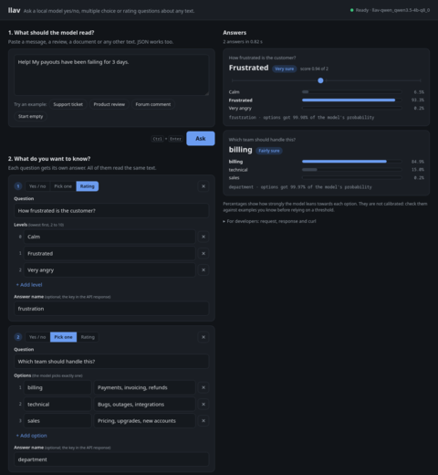

# llav

```
╭───────────────────────────╮
│    ╷   ╷                  │
│    │   │   ╶─╮  ╲    ╱    │
│    │   │   ╭─┤   ╲  ╱     │
│    ╰─  ╰─  ╰─╯    ╲╱      │
│                           │
│  decisions from logprobs  │
╰───────────────────────────╯
```

Typed semantic decisions from a local open model, served over an HTTP API shaped like TypeSafe's
System One API (`POST /v1/systemone`).

*Independent project; not affiliated with or endorsed by TypeSafe. Jev and TypeSafe are the property of
their respective owners. llav reproduces the public request/response shape, not Jev's model.*

You send a `state` and a map of typed questions (`noul`, `choice`, `score`). llav asks a local model
([Qwen3.5-4B](https://huggingface.co/Qwen/Qwen3.5-4B) GGUF via
[llama.cpp](https://github.com/ggml-org/llama.cpp)) each question in a single forward pass and reads the
probabilities of the answer labels straight from the logits. Nothing is generated or parsed.

- **No Python dependencies.** Standard library only. The runtime is `llama-server`.
- **Runs on any llama.cpp backend**, including Vulkan, CUDA, Metal, SYCL and CPU.
- **Fast on repeated text.** A state is evaluated once per request and kept for later ones, so follow-up
  questions about the same text cost about 0.2 s instead of 3 s on the laptop under Performance.

## Quick start

1. Install llama.cpp so that `llama-server` is on your `PATH`. Any of these work:

   | Platform         | Install                                                                                    |
   |------------------|--------------------------------------------------------------------------------------------|
   | macOS, Linux     | `brew install llama.cpp` (Metal on Apple Silicon)                                          |
   | Windows          | `winget install llama.cpp`                                                                 |
   | Arch             | `pacman -S llama-cpp` plus a backend package such as `ggml-vulkan`                         |
   | Any              | A [release build](https://github.com/ggml-org/llama.cpp/releases) for your GPU             |
   | Any, from source | llama.cpp's [build guide](https://github.com/ggml-org/llama.cpp/blob/master/docs/build.md) |

   A GPU backend (CUDA, Vulkan, Metal, ROCm or SYCL) is much faster; CPU-only works. If `llama-server` is
   not on `PATH`, point llav at it with `--llama-server PATH`.

2. Download the model (4.6 GB, SHA-256 checked):

   ```bash
   scripts/fetch-model.sh ~/models
   ```

   Four alternatives are pinned too, all Apache 2.0: `qwen3.5-2b` (2.1 GB, the fastest),
   `granite-4.0-h-tiny` (7.4 GB), `granite-4.2-3b` (3.9 GB) and `smollm3-3b` (3.3 GB). Pass one as a second
   argument. Only the default is validated; [agent_docs/research.md](agent_docs/research.md) compares them
   and lists the models that failed.

3. Serve from the checkout. Nothing needs installing:

   ```bash
   PYTHONPATH=src python3 -m llav --gguf ~/models/Qwen_Qwen3.5-4B-Q8_0.gguf --port 8080 --web-ui
   ```

   `--web-ui` serves a page at http://localhost:8080/ for trying questions in a browser. For a `llav`
   command on your `PATH`, for example to run it as a service, use `pipx install .`.

   <a href="docs/webui.png"></a>

4. Ask:

   ```bash
   curl -s localhost:8080/v1/systemone -H 'Content-Type: application/json' -d '{
     "state": "Help! My payouts have been failing for 3 days.",
     "model": "llav-latest",
     "questions": {
       "is_urgent":   {"type": "noul", "instructions": "Does this convey urgency?"},
       "department":  {"type": "choice", "instructions": "Which team should handle this?",
                       "criteria": {"billing": "Payments, invoicing, refunds",
                                    "technical": "Bugs, outages, integrations",
                                    "sales": "Pricing, upgrades, new accounts"}},
       "frustration": {"type": "score", "instructions": "How frustrated is the customer?",
                       "criteria": ["Calm", "Frustrated", "Very angry"]}
     }
   }'
   ```

   ```json
   {
     "model": "llav-qwen_qwen3.5-4b-q8_0",
     "answers": {
       "is_urgent": {"type": "noul", "noul": 0.997},
       "department": {"type": "choice", "choice": "billing",
                      "probabilities": {"billing": 0.849, "technical": 0.150, "sales": 0.002},
                      "confidence": 0.605},
       "frustration": {"type": "score", "score": 0.937,
                       "legend": {"0": "Calm", "1": "Frustrated", "2": "Very angry"},
                       "probabilities": {"0": 0.065, "1": 0.933, "2": 0.002},
                       "confidence": 0.769}
     },
     "usage": {"input_tokens": 249, "output_tokens": 0}
   }
   ```

   The response above is abridged: real responses carry full-precision floats. Probabilities and token
   counts vary slightly with the llama.cpp build and backend.

## API

`POST /v1/systemone` takes `{"state", "model", "questions"}`:

- **`state`** is a nonempty string, object or array.
- **`model`** is the served model id, `llav-latest` or `jev-latest` (`--no-jev-alias` refuses the last).
- **`questions`** maps your keys to questions, each with a `type`, `instructions` (string, object or array)
  and `criteria`:

| Type | `criteria` | Answer |
|---|---|---|
| `noul` | optional `{"true": ..., "false": ...}` | `{"type": "noul", "noul": p_yes}` |
| `choice` | `{option: description or null}`, 2–26 options | `{"type": "choice", "choice", "probabilities", "confidence"}` |
| `score` | ordered array of 2–10 levels | `{"type": "score", "score", "legend", "probabilities", "confidence"}` |

- **A `noul`'s `criteria` are repeated in the criterion text**, because `Yes` and `No` say nothing on their
  own and some models read only the criterion. Writing the rule in `criteria`, in `instructions`, or in
  both works the same; `choice` and `score` are untouched, since there the descriptions are the options.
- **A `choice` key that is a single letter is shown to the model at that answer letter**, so keys `B`,
  `insufficient`, `A` reach it as A, B, C. Otherwise the model confuses option names with answer letters.
  The answer keeps your keys and their order.
- **`score`** is the probability-weighted level index, `Σ i·p_i` with 0-based levels, so it can land between
  levels.
- **`confidence`** is `1 − H(p)/ln(n)`: 1 when all the probability is on one option, 0 when it is uniform.
  TypeSafe does not publish its formula, so this is llav's own.
- **`usage.input_tokens`** counts the tokens llav evaluated: a shared state once, a cached state not at all.
  `output_tokens` is always 0.
- Errors return `{"detail": ...}`: **422** for anything the caller can fix (a malformed body, an unknown
  model, a prompt too long for a slot, with the field path), **401** for a bad key, **413** over 8 MiB,
  **529** when every slot stayed busy for `--queue-timeout`, **500** when the backend fails. A 400, 401, 404,
  411 or 413 is sent before the body is read and closes the connection, so a client still uploading a large
  body may see a broken pipe instead of the status. Check the size before sending rather than relying on
  reading the 413.
- Every response carries `X-Llav-Seconds`, `X-Llav-Shared-State-Tokens` and `X-Llav-State-Cache`
  (`hit`, `miss` or `off`).
- `X-Llav-Calibration` is `none`, or the id of the temperature file loaded with `--calibration`.
- `X-Llav-Candidate-Mass` lists, per question in answer order, the probability the model gave the option
  letters over its whole vocabulary, for example `0.9991,0.9874`. Well below 1 means the model wanted to
  say something else and the answer's probabilities are not worth reading. Near 1 says nothing about
  whether the answer is right.

The other endpoints: **`GET /v1/models`** (id, aliases, backend details), **`GET /openapi.json`** (the full
contract, built from the code that serves it, also committed as [openapi.json](openapi.json)),
**`GET /health`**, and **`GET /`** for the web UI. Set `--api-key` or `LLAV_API_KEY` to require
`Authorization: Bearer <key>`; without one, auth is off. llav binds to `127.0.0.1` by default.

## How it works

Every question becomes one prompt: a fixed system instruction, then a JSON payload
`{"evidence": state, "criterion": instructions, "options": [{"letter": "A", "description": ...}, ...]}`.
llav renders it with the model's own chat template, thinking disabled, and reads the next-token
log-probabilities of `A`, `B`, … softmaxed over the declared options. Nothing is sampled, so there is no
text to parse, no reasoning tokens to wait through, and nothing to retry when a model answers in prose.

The readout is [SemIf](https://github.com/TheoLeeCJ/SemIf)'s `direct-options-v1`. Checked against SemIf's
published PyTorch predictions on its 777 owned decisions: all 777 prompts identical, 768 answers agreed, and
every disagreement was a near-tie between 0.47 and 0.53.

Reading the state is most of the work, about 3 s for 1,800 tokens against 0.15 s for a question on top of
it. So llav reads it once per request and keeps it for later requests (`--state-cache`, four states by
default). Whether a model needs a saved slot file between questions is settled by a startup probe rather
than a list of model names; `GET /v1/models` reports the choice as `backend.prefix_reuse`. The optional
[native helper](native/README.md) answers every question of a request in one batched pass instead of one
llama-server pass each, which cuts a repeat request of 10 questions from 0.65 s to 0.21 s on an RTX 3090.

[agent_docs/architecture.md](agent_docs/architecture.md) has the request flow and the slot handling, and
[agent_docs/research.md](agent_docs/research.md) the measurements behind all of it.

## Performance

Qwen3.5-4B Q8_0, a 1,800-token state, 10 yes/no questions. "Repeat" is the same state arriving in a later
request; the last column is the same two numbers with the native helper.

| Machine                        | First request | Repeat | With the helper |
|--------------------------------|--------------:|-------:|----------------:|
| Laptop, Intel Arc B390, Vulkan |        4.70 s | 1.73 s | 3.86 s / 1.22 s |
| RTX 3090, CUDA                 |        1.16 s | 0.65 s | 0.75 s / 0.21 s |

`scripts/benchmark.py` reproduces these. Per-phase costs, the other pinned models, an Apple M3 run,
estimates for other hardware and what a text-generating baseline would cost are in
[agent_docs/research.md](agent_docs/research.md).

## Differences from Jev

- **Model and accuracy.** A 4B open model with an untrained readout. Probabilities are uncalibrated
  conditional scores: calibrate on your own labelled data before thresholding on them.
  `scripts/evaluate.py score URL FILE.jsonl` reports accuracy, calibration error and how much can be
  answered automatically at a given error rate on such data; its docstring gives the file format.
  `scripts/evaluate.py fit` turns those predictions into a temperature file that `--calibration` loads;
  answers then carry calibrated probabilities and `X-Llav-Calibration` names the file. It is fitted to one
  model file and one workload, and llav ships none.
- **Choice size.** llav allows at most 26 options (single-token letters `A`–`Z`); Jev allows 255.
- **Confidence formula.** Jev's formula is unpublished, so llav uses its own (see above).
- **Usage and limits.** Token counts follow llav's evaluation, not Jev's billing. There are no
  rate-limit tiers: overload returns `529`.
- **Instructions stay literal.** Backticked references in `instructions` are passed through verbatim to the
  model, which sees the state as JSON.

## Options

```
llav --gguf FILE [--port 8080] [--host 127.0.0.1] [--slots 1] [--ctx 8192]
     [--api-key KEY] [--model-id ID] [--no-jev-alias] [--queue-timeout 30] [--state-cache 4] [--web-ui]
     [--native-readout BIN] [--native-questions 16] [--calibration FILE]
     [--llama-server BIN] [--llama-port 8089] [--llama-arg ARG ...]

llav --llama-url http://127.0.0.1:8089 --slot-dir DIR   # attach to your own llama-server
```

Pass llama.cpp flags through with `--llama-arg`, for example `--llama-arg=-dev --llama-arg=Vulkan0`. When
attaching to your own server, start it with `--ctx-checkpoints 0 --slot-save-path DIR --jinja`.

## License

MIT; see [LICENSE](LICENSE) and [THIRD_PARTY.md](THIRD_PARTY.md).
